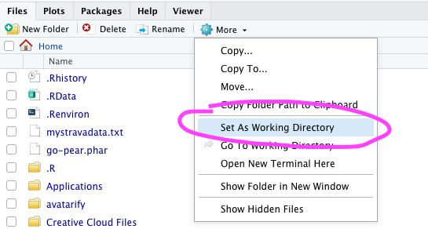

# File management en directories
De manier waarop RStudio werkt met directories is afhankelijk van je besturingssysteem en accountinstellingen. Vaak moet je via de file explorer rechtsonder iedere keer navigeren naar de map waar je (netjes als je bent) al je werk in R in submappen hebt staan.

## Veranderen working directory (default map)
De makkelijkste manier is om via de GUI de op dat moment actieve map als working directory in te stellen (zie hieronder)  
  

Uiteraard kun je dit ook via de console regelen met een `getwd/setwd` commando. Voor meer details check je dit [artikel](https://support.rstudio.com/hc/en-us/articles/200711843-Working-Directories-and-Workspaces)

## Best practices file management
Om je bestandsbeheer in goede banen te leiden hebben we de volgende tips:
- Maak een aparte map (op je cloud omgeving zoals OneDrive of iCloud) voor je R projecten (uiteraard alleen van toepassing als je RStudio zelf geïnstalleerd hebt)
- Per project maak je een eigen submap waarin je meteen je .Rmd bestand opslaat.
- Eventuele bronnen (datafiles, plaatjes etc) sla je op in een submap van je projectmap. 

**Voorbeeld**
> Onedrive/MyRProjects/Project_1/FirstSteps.Rmd  
> Onedrive/MyRProjects/Project_1/data/Mydata.xls