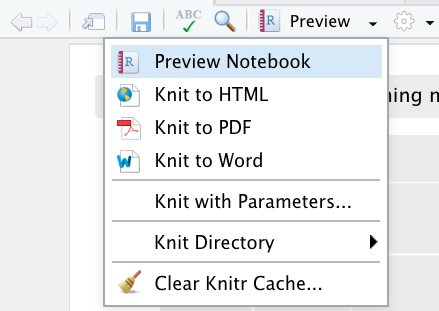

# Notebooks exporteren
Je kan via R studio je notebooks eigenlijk op 2 manieren exporteren: als HTML file of als PDF.
Belangrijk hierbij is om te weten wat er dan eigenlijk gebeurt en wat je moet checken.

Exporteren werkt als volgt:

  

- Als je op Knit to.. klikt worden alle chunks achter elkaar uitgevoerd.
- Dat betekent dat alle **file referenties** voor bv importeren van datasets moeten kloppen
- Alle files worden gezocht tov de locatie waar je notebook zich bevindt.
- Je zal dus expliciet een bestand moeten laden via bv de read_excel functie oid.
- Foutmelding wijzen je vaak op potentiele issues, lees ze dus goed en google eventueel wat ze betekenen.
- notebooks waarbij authenticatie een rol speelt 9API's) zijn tricky om te exporteren. Als een export draait, is er **geen interactie** mogelijk. Je moet je notebook dan dus zo configureren dat er geen authenticatie oid nodig is.
- Om naar PDF te exporteren heb je een aparte package nodig. heb je die niet dan krijg je vaak deze fout:

- Installeer dan via de console TinyTex :
- > `tinytex::install_tinytex()`  
